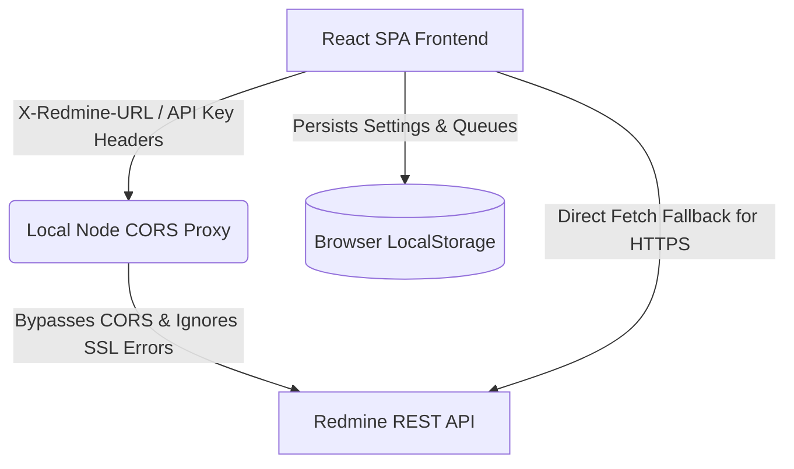

# Redmine Time Tracker

## Context-Aware Queue Timer and High-Fidelity Time Entry Logger for Redmine

Daily time tracking is a major pain point for developers. Most of us log our hours late, usually at the end of the week. This makes the logged descriptions vague, like "bug fixes" or "work on task." It makes report statistics inaccurate. Redmine Time Tracker is a React single-page application built to solve this. It provides a simple task queue and a live timer. While the timer is running, you can log micro-activities. These are tiny notes of what you are doing in real time. When you stop the timer, the application compiles all notes into a single detailed comment and posts the aggregated entry to Redmine. This process makes reports accurate. 

This app was developed with AI agents. We developed this project for work in partnership with Lyuboslav Stankov, using AI coding agents to build a responsive, developer-centric interface.


*(Note: Replace this placeholder image with a screenshot of the dashboard showing the active timer and task queue).*

---

## Technologies

The application is built using a modern frontend stack geared towards performance, maintainability, and clean UI design:

*   **Core:** React 19, TypeScript
*   **Build Tool:** Vite
*   **UI Framework:** [Mantine v7](https://mantine.dev/) (`@mantine/core`, `@mantine/hooks`, `@mantine/form`, `@mantine/notifications`)
*   **Icons:** `@tabler/icons-react`
*   **Routing:** `react-router-dom`
*   **Proxy/Network:** Express, `http-proxy-middleware` (for local CORS bypass)

> [!NOTE]  
> All UI components utilize Mantine v7's built-in flex and grid systems (`Stack`, `Group`, `SimpleGrid`). Custom SCSS has been intentionally removed in favor of Mantine's standardized component styling.

---

## Project Structure

The codebase is organized by feature to ensure modularity and separation of concerns.

```text
src/
├── assets/         # Static assets and global resources
├── components/     # Reusable structural layout components (AppShell, Header)
├── contexts/       # React Context providers (TimerContext, QueueContext, etc.)
├── features/       # Feature-driven modules (Core application logic)
│   ├── calendar/   # Calendar grid, bulk logging, and day details
│   ├── queue/      # Task queue list and task addition forms
│   ├── settings/   # Application configuration and API keys
│   ├── timer/      # Live timer bar and micro-activity logging
│   └── tracker/    # Aggregated dashboard views and summary modals
├── hooks/          # Shared custom React hooks for Redmine data fetching
├── services/       # External API communications (redmine.ts)
├── types/          # TypeScript interface declarations
└── utils/          # Helper functions and formatters
```

---

## Technical Architecture & Core Patterns

The application is structured to minimize friction. We want to keep the UI snappy and ensure no timer progress gets lost if you refresh your browser.



### 1. State Synchronization & Contexts
State management is decoupled into React Contexts to prevent prop drilling and keep components modular:
*   [TimerContext.tsx](./src/contexts/TimerContext.tsx): Controls the active timer ticks, starts/resumes epoch time, and stores elapsed duration.
*   [QueueContext.tsx](./src/contexts/QueueContext.tsx): Holds the array of task items (Todos), manages reordering, and handles background synchronization. All queue states are loaded from and serialized to `localStorage` automatically.
*   [RedmineContext.tsx](./src/contexts/RedmineContext.tsx) & [UserContext.tsx](./src/contexts/UserContext.tsx): Cache the active connection status and details of the current Redmine user session.

### 2. High-Resolution Micro-Activity Tracking
The core feature is the timeline of performed tasks inside a tracking session. This is handled by [useQueueTimer.ts](./src/hooks/useQueueTimer.ts):
*   **Initial Prompt:** When starting a timer for a new task, the application blocks execution until you type your first micro-activity. This ensures every session has at least one detail.
*   **Incremental Timing:** When you add a new activity description during a session, the system calculates the duration of the *previous* activity by subtracting its start time from the current elapsed seconds. This gives a sub-task timing log.
*   **Aggregation:** On stop, [SummaryModal.tsx](./src/features/tracker/components/SummaryModal.tsx) combines all activity texts into a single string. It rounds the accumulated seconds to decimal hours. The system rounds up to the nearest 0.05 hours (3 minutes) to align with business billing structures.

### 3. Local CORS Bypass Proxy
Browsers block direct HTTP requests from local web pages to external corporate Redmine instances due to CORS policies. We solve this with [proxy-simple.js](./proxy-simple.js):
*   It is an Express server running on port `3000`.
*   It accepts request payloads from the React app, extracts Redmine server targets and API keys from custom headers (`X-Redmine-URL` and `X-Redmine-API-Key`), and forwards them.
*   It uses a custom Node.js HTTPS agent configured to ignore SSL errors (`rejectUnauthorized: false`). This is crucial because many corporate Redmines run on intranet domains with self-signed SSL certificates.
*   If your Redmine server supports CORS directly and runs over HTTPS, [redmine.ts](./src/services/redmine.ts) can fall back to direct browser requests if the local proxy is offline.

---

## User Installation & Run Instructions

This application is meant to run locally on your development machine. Since it needs to forward requests to your corporate Redmine instance, you must run both the frontend app and the proxy server.

### Prerequisites
*   Node.js (v18 or higher recommended)
*   npm (packaged with Node.js)

### Quick Start
1.  Clone the repository:
    ```bash
    git clone https://github.com/apavlov/redmine-time-tracker.git
    cd redmine-time-tracker
    ```
2.  Install dependencies:
    ```bash
    npm install
    ```
3.  Launch the client and the proxy concurrently:
    ```bash
    npm run dev:full
    ```
4.  Open your browser and navigate to `http://localhost:5173`.
5.  Go to the **Settings** page in the application and enter your Redmine URL and personal API Key. You can find your API key on your Redmine account page (typically under *My Account* -> *API access key* in the right sidebar).

---

## Contributor Setup & Code Verification

If you want to modify features or add new endpoints, use the following guide.

### Codebase Entry Points
*   **API Integrations:** All endpoint calls are declared inside [redmine.ts](./src/services/redmine.ts).
*   **Time Aggregation:** The log modal is in [SummaryModal.tsx](./src/features/tracker/components/SummaryModal.tsx).
*   **Calendar Dashboard:** View log history grids in [CalendarGrid.tsx](./src/features/calendar/components/CalendarGrid.tsx) and [LoggedTimeDashboard.tsx](./src/features/calendar/components/LoggedTimeDashboard.tsx).

> [!TIP]
> When creating new UI components or modifying existing ones, always rely on `@mantine/core` and `@mantine/form` components instead of rolling bespoke SCSS styles. 

### Quality Checks
We enforce lint rules and type safety using ESLint and the TypeScript compiler. Make sure to run these checks before creating commits:
```bash
# Check lint issues
npm run lint

# Verify TypeScript compilation and build bundle
npm run build
```

---

## Known Issues & Architectural Constraints

We want to be transparent about limitations in our current implementation.

*   **Security Vulnerability in Proxy:** [proxy-simple.js](./proxy-simple.js) sets `rejectUnauthorized: false` to allow self-signed certificates. This opens the proxy to potential man-in-the-middle (MITM) attacks if run on an untrusted public network. Do not expose port 3000 to the public internet.
*   **Origin Whitelisting:** The proxy server restricts requests to a hardcoded list of local Vite ports (`5173`, `5174`, `5175`). If your Vite client starts on a different port, the proxy will reject CORS requests.
*   **LocalStorage Vulnerability:** All active queues and configurations are stored in browser local storage. Cleared cache or private browsing sessions will erase your local queue data.
*   **API Limits:** [redmine.ts](./src/services/redmine.ts) fetches logs for the calendar dashboard with a fixed query limit of 100 entries. It does not implement page pagination. If you log more than 100 entries within the selected range, some logs will be missing from the calendar view.

### Future Enhancements
*   **Electron Integration:** Wrap the app in a desktop container to allow floating widgets and active window tracking.
*   **Idle Tracking:** Auto-pause the timer if keyboard or mouse input stops for more than 5 minutes.
*   **Pre-populated Templates:** Save common tasks as presets for quick logging.
